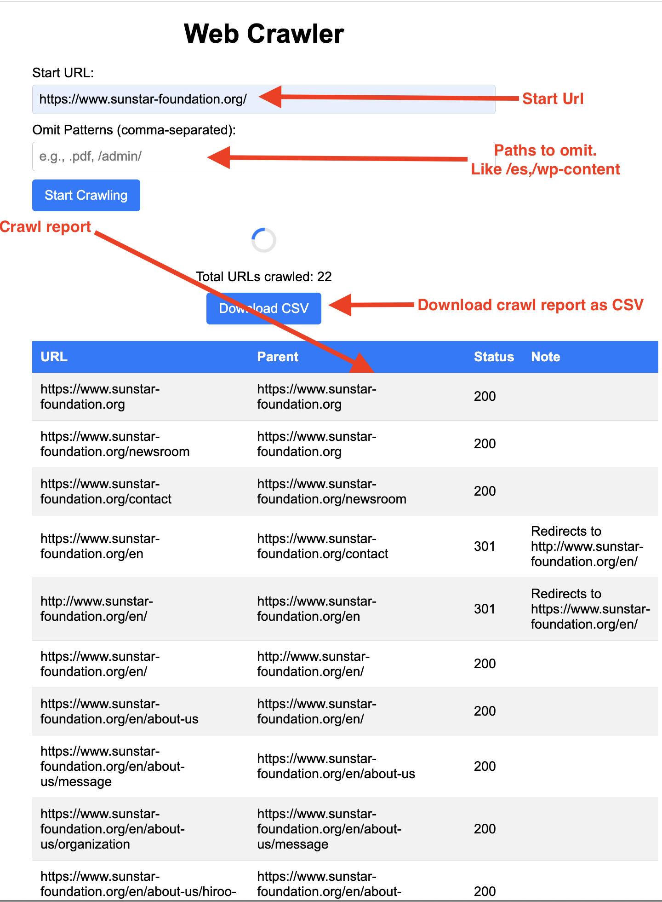

# A simple web-crawler (and downloader)

## Introduction
A simple web-crawler which can be used to crawl a website and download the markup of the pages.

**BONUS**  The crawler also loads and executes javascript that may be present in the pages, hence the downloaded markup is the same as what you would see in the browser.

### How to use
1. Install [Docker](https://docs.docker.com/get-docker/)
2. Run `docker run -p 3001:3001 -v <Cache folder on host>:/usr/src/app/cache -d --name web-tools satyadeepm/web-tools:latest`
3. OR if you don't want to use Docker, just synch this repository and execute the following:
    ```
    $ npm i
    $ npx playwright install
    $ npx playwright install-deps
    $ export port=<optional-port>; export cache=<optional-cache>;node src/app.js
    ```
5. Open `http://localhost:3001/crawler/crawler.html` in your browser.
6. Provide inputs and click on `Filter URLS` button

7. The crawler will start crawling the website and will show the results in the table below.
8. Click on `Download CSV` button to download the results in CSV format.
9. **Offline Site Download** The site's markup will be cached in the `cache` folder.

### Other useful commands
1. To open a bash shell in the container, run `docker run -it -p 3001:3001 -v /Users/satyam/Downloads/webtools-cache:/usr/src/app/cache -d --name web-tools satyadeepm/web-tools:latest bash`

